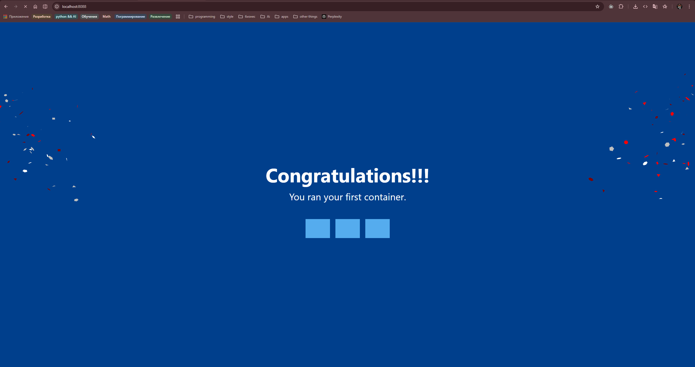
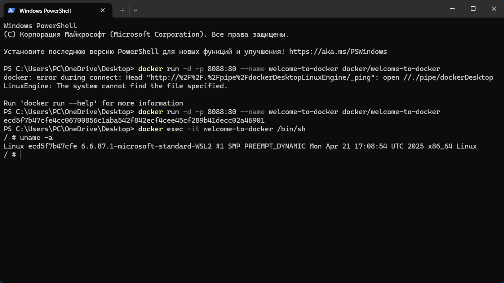
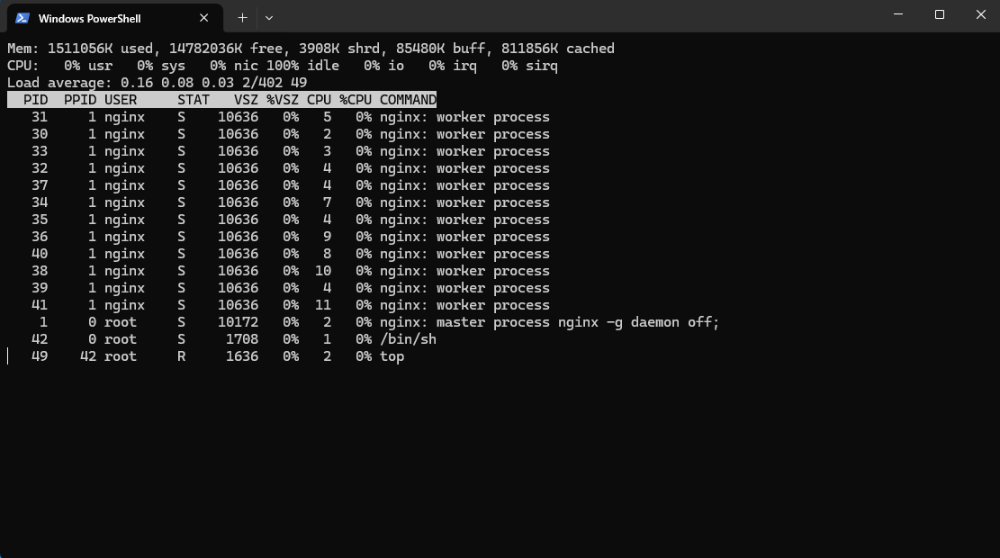
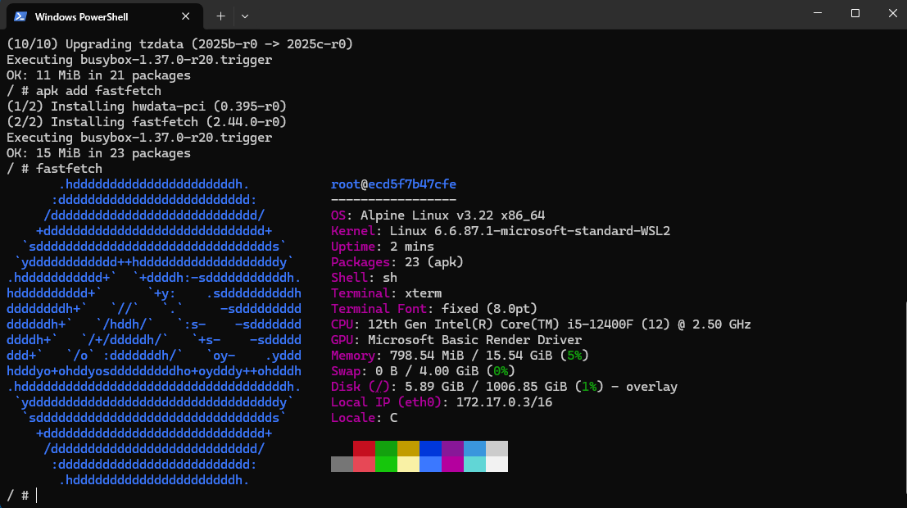

# Welcome to Docker

## Проверка порта 8088

### Linux

```bash 
ss -tuln | grep 8088
# или
netstat -tuln | grep 8088
```

Проверяем, что порт 8088 не занят другим процессом.

### Windows

```powershell
netstat -ano | findstr :8088
```

---

## Запуск контейнера

```bash
docker run -d -p 8088:80 --name welcome-to-docker docker/welcome-to-docker
```

**Описание команды:**
- `docker run` — запуск нового контейнера
- `-d` — запуск в фоновом режиме (detached)
- `-p 8088:80` — проброс порта: хост 8088 → контейнер 80
- `--name welcome-to-docker` — имя контейнера
- `docker/welcome-to-docker` — образ из Docker Hub

**Пример вывода:**

```text
Unable to find image 'docker/welcome-to-docker:latest' locally
latest: Pulling from docker/welcome-to-docker
a6d2e66eef0e: Pull complete
Digest: sha256:3a5a5e9f0e2d5c8b4f8e7d6c5a4b3e2f1d0c9b8a7
Status: Downloaded newer image for docker/welcome-to-docker:latest
c8f9e12d3456abcdef1234567890abcdef1234567890abcdef1234567890ab
```

---

## Проверка работы в браузере

Открываем браузер и переходим по адресу:

```
http://localhost:8088
```



---

## Подключение к контейнеру

```bash
docker exec -it welcome-to-docker /bin/sh
```

**Описание команды:**
- `docker exec` — выполнение команды в работающем контейнере
- `-it` — интерактивный режим с псевдо-терминалом
- `welcome-to-docker` — имя контейнера
- `/bin/sh` — оболочка внутри контейнера

---

## Команды внутри контейнера

### Информация о системе

```bash
uname -a
```

**Описание:** выводит информацию о ядре системы (имя хоста, ОС, версия ядра, архитектура).

**Пример вывода:**

```text
Linux 5f8e4d3c2b1a 5.15.0-1049-aws #51-Ubuntu SMP x86_64 Linux
```



---

### Мониторинг процессов

```bash
top
```

**Описание:** отображает список активных процессов и использование системных ресурсов (CPU, память).

**Пример вывода:**

```text
Mem: 16436K used, 812K free, 0K buff, 12044K cached
PID   USER     PR  NI    VIRT    RES    SHR S  %CPU  %MEM     TIME+ COMMAND
    1 root     20   0    8928   5184   4096 S  0.0  31.2   0:00.05 nginx
    6 root     20   0    3520   1780   1432 S  0.0  10.7   0:00.02 sh
    7 root     20   0    5900   2860   2288 R  0.0  17.2   0:00.01 top
```



---

### Обновление пакетов

```bash
apk update && apk upgrade
```

**Описание:**
- `apk update` — обновление списка пакетов из репозитория Alpine Linux
- `apk upgrade` — обновление установленных пакетов до последних версий

**Пример вывода:**

```text
fetch https://dl-cdn.alpinelinux.org/alpine/v3.19/main/x86_64/APKINDEX.tar.gz
fetch https://dl-cdn.alpinelinux.org/alpine/v3.19/community/x86_64/APKINDEX.tar.gz
v3.19.2-168-g0f469bb0a0a [https://dl-cdn.alpinelinux.org/alpine/v3.19/main]
v3.19.2-167-g0a0b1c2d3e4f [https://dl-cdn.alpinelinux.org/alpine/v3.19/community]
(1/10) Upgrading musl (1.2.4-r5 -> 1.2.5-r0)
(2/10) Upgrading busybox (1.36.1-r2 -> 1.36.1-r3)
OK: 12 packages, 0 available, 0 not found
```

---

### Установка fastfetch

```bash
apk add fastfetch
```

**Описание:** утилита для красивого отображения информации о системе (аналог neofetch).

**Пример вывода:**

```text
(1/1) Installing fastfetch (2.11.5-r0)
OK: 14 packages, 0 available, 0 not found
```

---

### Запуск fastfetch

```bash
fastfetch
```

**Описание:** отображает красивую информацию о системе (ОС, ядро, память, процессоры, uptime и т.д.).

**Пример вывода:**




---

## Итог

В ходе выполнения задания "Welcome to Docker" мы:
1. Проверили доступность порта 8088
2. Запустили контейнер с образом `docker/welcome-to-docker`
3. Проверили работу приложения в браузере
4. Подключились к контейнеру через оболочку
5. Изучили основные команды мониторинга системы
6. Обновили пакеты в Alpine Linux
7. Установили и запустили утилиту fastfetch

Контейнер работает корректно и доступен по адресу `http://localhost:8088`.
